# 用户交互流程文档

本文档使用 Mermaid 流程图详细记录"关系安那其自助拼盘"应用的页面交互逻辑。

---

## 目录

1. [整体页面结构](#整体页面结构)
2. [核心用户流程](#核心用户流程)
3. [页面跳转逻辑](#页面跳转逻辑)
4. [详细交互说明](#详细交互说明)
5. [数据流](#数据流)

---

## 整体页面结构

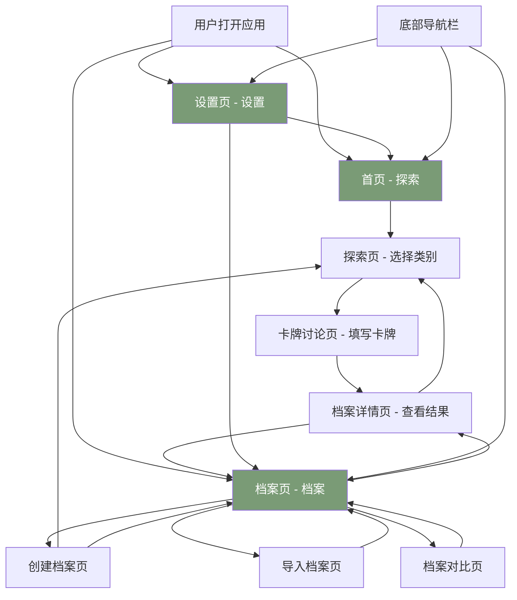

---

## 核心用户流程

### 流程 1：首次使用（创建档案并探索）

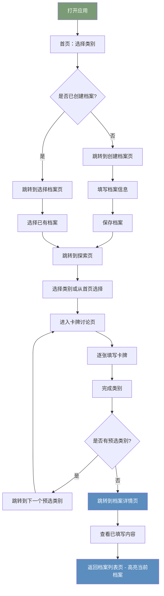

### 流程 2：异步协作（导出-导入）

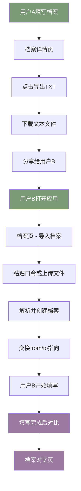

### 流程 3：档案对比

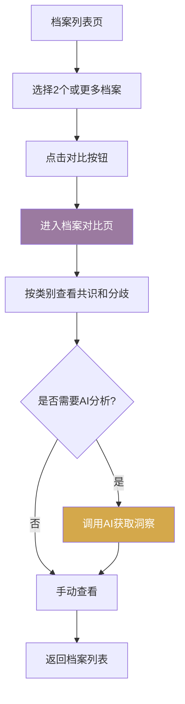

---

## 页面跳转逻辑

### 首页 → 探索流程

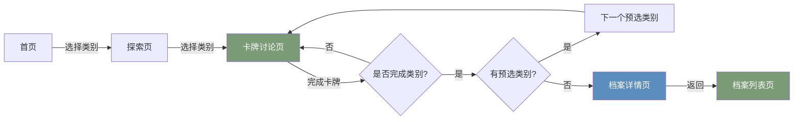

### 档案管理流程

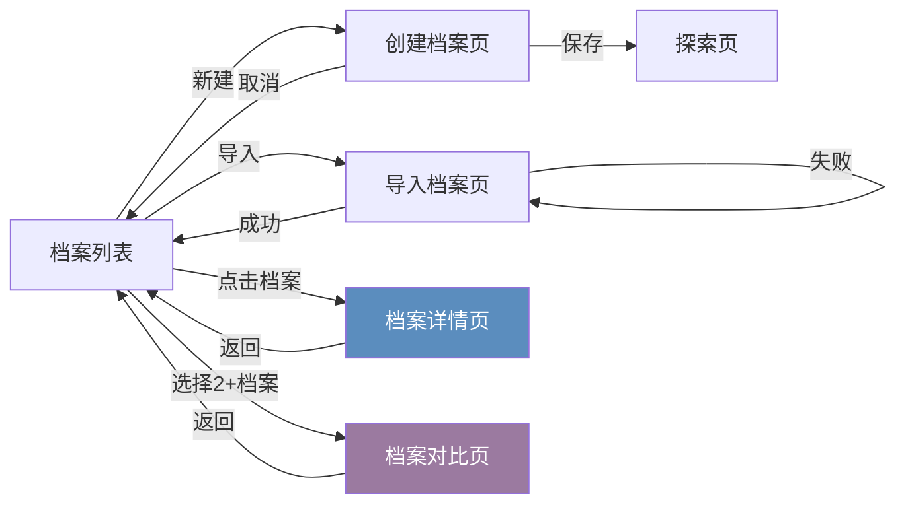

---

## 详细交互说明

### 1. 首页（探索）

**功能**：
- 显示 28 个关系类别
- 支持多选类别
- 随机抽取功能
- 开始探索按钮

**交互**：
- 点击类别卡片：切换选中状态
- 点击"随机抽取"：随机选择 3 个类别
- 点击"开始探索"：
  - 如果没有档案 → 跳转到创建档案页（携带选中的类别）
  - 如果有档案 → 跳转到选择档案页（携带选中的类别）

**数据流**：
```
首页 → URL参数: ?categories=id1,id2,id3
```

---

### 2. 探索页（选择类别）

**功能**：
- 显示用户预选的类别（从首页携带）
- 显示所有可用类别
- 显示每个类别的完成进度
- 随机选择未完成类别

**交互**：
- 点击预选类别：进入卡牌讨论页
- 点击其他类别：进入卡牌讨论页（携带预选类别参数）
- 点击"随机"：随机选择一个未完成类别

**数据流**：
```
探索页 → URL参数: ?categories=id1,id2,id3
    ↓
卡牌讨论页 → URL参数: ?categories=id1,id2,id3
```

---

### 3. 卡牌讨论页

**功能**：
- 逐张显示类别中的卡牌
- 选择状态标签（可多选）
- 添加备注
- 上一张/下一张导航
- 跳过/保存功能

**交互**：
- 点击状态标签：切换选中状态
- 输入备注：实时保存
- 点击"跳过"：跳过当前卡牌，进入下一张
- 点击"保存并继续"：保存当前回答，进入下一张
- 点击左上角返回：返回档案详情页（高亮当前档案）

**自动跳转逻辑**：
```
完成当前类别
    ↓
检查是否有预选类别（URL参数）
    ↓
    ├─ 有 → 跳转到下一个预选类别
    └─ 无 → 跳转到档案详情页
```

---

### 4. 档案详情页

**功能**：
- 显示档案基本信息
- 显示探索进度
- 导出/分享功能
- 显示已填写的项目（过滤空记录）

**交互**：
- 点击返回：返回档案列表页（带高亮参数）
- 点击"导出TXT"：下载档案数据
- 点击"分享口令"：复制分享代码到剪贴板

**数据流**：
```
档案详情页 → 返回时携带参数
    ↓
档案列表页 ?highlight=profileId
    ↓
高亮闪烁指定档案（3秒）
```

---

### 5. 档案列表页

**功能**：
- 显示所有档案（按创建时间倒序）
- 创建新档案
- 导入档案
- 选择档案进行对比
- 删除档案

**交互**：
- 点击档案：进入档案详情页
- 点击"新建"：进入创建档案页
- 点击"导入"：进入导入档案页
- 勾选2个以上档案：显示"对比"按钮
- 点击"对比"：进入档案对比页
- 点击删除图标：显示确认弹窗

**排序规则**：
```
profiles.sort((a, b) =>
  new Date(b.createdAt) - new Date(a.createdAt)
)
```

**高亮效果**：
- 从URL参数读取 `highlight=profileId`
- 添加 `animate-pulse ring-4 ring-primary/50` 样式
- 3秒后自动清除高亮和URL参数

---

### 6. 档案对比页

**功能**：
- 对比多个档案
- 按类别分组显示共识和分歧
- AI分析功能（可选）

**交互**：
- 切换类别：查看不同类别的对比结果
- 点击AI分析：生成洞察报告
- 点击返回：返回档案列表

---

### 7. 设置页

**功能**：
- 主题切换（浅色/深色/跟随系统）
- 关于信息
- 使用提示
- 隐私说明
- 原作信息
- 中文版原图下载

**交互**：
- 点击主题选项：切换主题模式
- 点击下载按钮：下载中文版原图
- 点击图片：下载图片

**主题逻辑**：
```
用户选择主题
    ↓
保存到 localStorage
    ↓
更新 document.documentElement class
    ↓
应用 CSS 变量
```

---

## 数据流

### 1. 档案数据结构

```typescript
interface Profile {
  id: string;
  name: string;
  fromName: string;      // 填表人
  toName: string;        // 对方
  relationLabel: string; // 关系标签
  createdAt: string;
  isImported?: boolean;
  importedFrom?: string;
  progress: CategoryProgress[];
}

interface CategoryProgress {
  categoryId: string;
  answers: CardAnswer[];
}

interface CardAnswer {
  cardId: string;
  statuses: StatusLabel[]; // 选中的状态标签
  note?: string;            // 备注
}
```

### 2. 类别选择传递流程

```
首页选择类别
    ↓
URL参数: ?categories=id1,id2,id3
    ↓
传递到档案创建页（创建时保存到预选）
    ↓
传递到探索页（显示预选类别）
    ↓
传递到卡牌讨论页（用于自动跳转）
    ↓
完成一个类别后跳到下一个预选类别
    ↓
所有预选类别完成 → 跳到档案详情页
```

### 3. 高亮效果数据流

```
卡牌讨论页完成
    ↓
跳转到档案详情页
    ↓
点击返回按钮
    ↓
URL参数: /profiles?highlight=profileId
    ↓
档案列表页读取highlight参数
    ↓
高亮指定档案卡片
    ↓
3秒后清除高亮和URL参数
```

---

## 状态转换图

### 档案状态

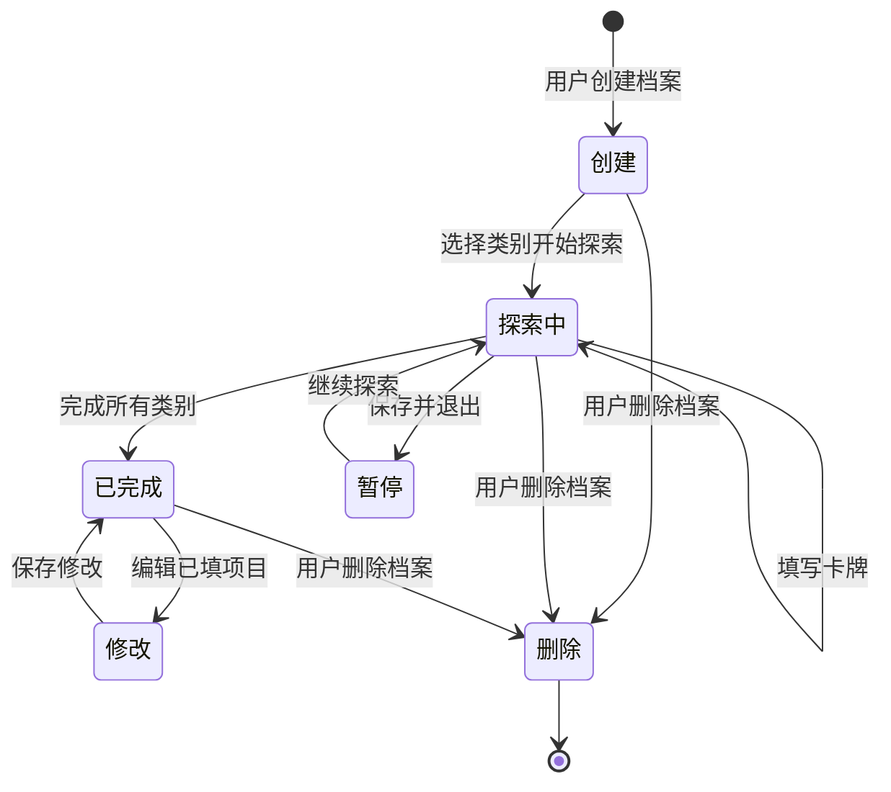

---

## 关键交互细节

### 1. 预选类别的记忆机制

**问题**：用户在首页选择的类别，如何在探索流程中保持？

**解决方案**：
1. 首页选择后，将类别ID拼接到URL：`?categories=id1,id2,id3`
2. 探索页从URL读取并显示预选类别
3. 卡牌讨论页从URL读取预选类别
4. 完成一个类别后，检查是否还有预选类别
5. 自动跳转到下一个预选类别

**示例**：
```
首页选择：[情感亲密, 性, 身体亲密]
    ↓
URL: ?categories=emotional,intimacy,physical
    ↓
探索页显示：已选择的类别
    ↓
卡牌讨论页：完成"情感亲密"后
    ↓
自动跳转到"性"（下一个预选类别）
    ↓
完成"性"后自动跳转到"身体亲密"
    ↓
完成所有预选类别 → 跳转到档案详情页
```

### 2. 档案高亮闪烁机制

**目的**：引导用户了解填写的档案在哪里

**实现**：
1. 档案详情页返回时携带参数：`/profiles?highlight=profileId`
2. 档案列表页读取 `highlight` 参数
3. 给指定档案卡片添加样式：`animate-pulse ring-4 ring-primary/50`
4. 3秒后使用 `setTimeout` 清除高亮
5. 使用 `window.history.replaceState` 清除URL参数

### 3. 档案排序机制

**规则**：按创建时间倒序排列（最新的在最上面）

**代码**：
```javascript
profiles.sort((a, b) =>
  new Date(b.createdAt).getTime() - new Date(a.createdAt).getTime()
)
```

### 4. 进度条显示逻辑

**公式**：
```
进度百分比 = (已完成卡牌数 / 总卡牌数) × 100%
总卡牌数 = 所有类别卡牌数之和（固定为 28 个类别的总和）
已完成卡牌数 = 所有 categoryProgress.answers.length 之和
```

---

## 特殊场景处理

### 场景1：没有档案时的首页交互

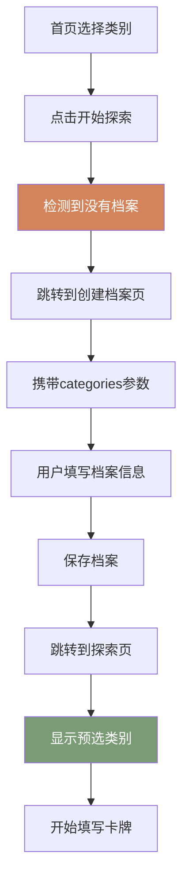

### 场景2：档案导入后的数据交换

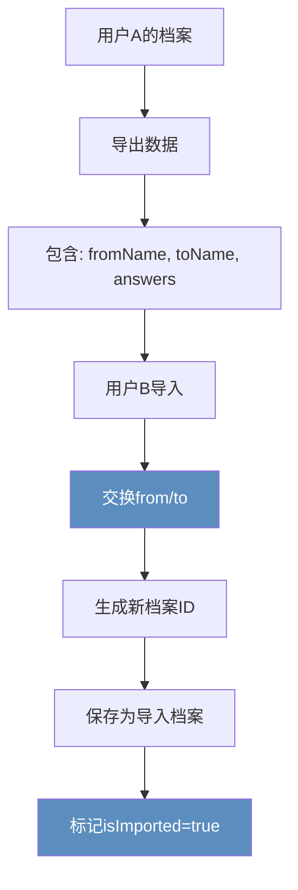

### 场景3：完成所有类别后的行为

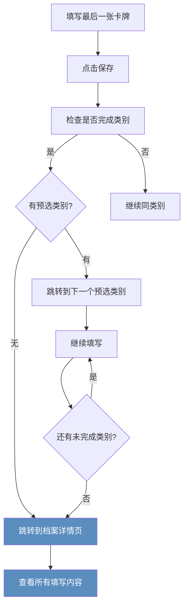

---

## 主题切换逻辑

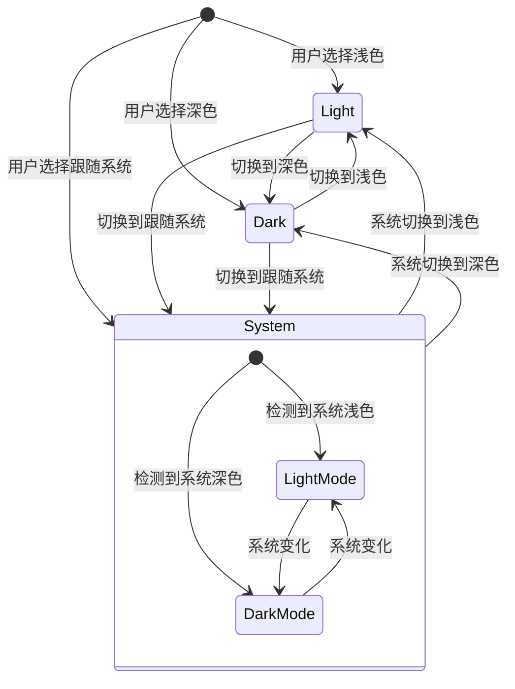

---

## 错误处理流程

### 场景1：档案不存在

```mermaid
flowchart TD
    A[访问 /profiles/:id] --> B{档案存在?}
    B -->|否| C[显示"档案不存在"提示]
    C --> D[点击返回]
    D --> E[返回档案列表页]
    B -->|是| F[正常显示详情]

    style C fill:#C75B5B,color:#fff
```

### 场景2：网络请求失败（如果未来添加）

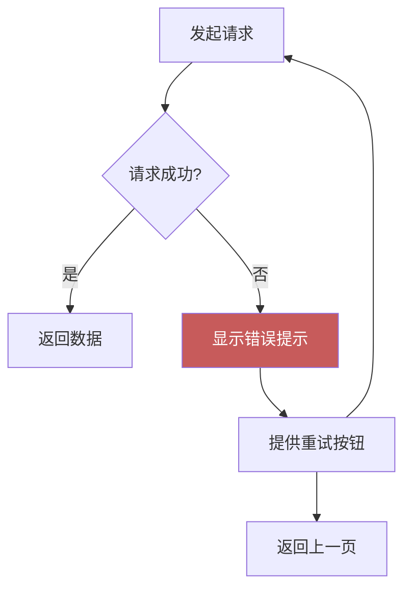

---

## 性能优化点

1. **懒加载**：卡牌数据按需加载
2. **本地存储**：所有数据保存在 localStorage，无需网络请求
3. **高亮动画**：使用 CSS 动画而非 JavaScript 动画
4. **URL参数传递**：避免在 localStorage 中存储临时状态

---

## 总结

本文档详细记录了"关系安那其自助拼盘"应用的完整用户交互流程，包括：

✅ 8 个主要页面的功能
✅ 核心用户流程（首次使用、异步协作、档案对比）
✅ 详细的页面跳转逻辑
✅ 数据流和状态管理
✅ 特殊场景处理
✅ 主题切换机制
✅ 错误处理流程

所有流程图使用 Mermaid 语法编写，可在支持 Mermaid 的平台（如 GitHub、GitLab、Notion）中自动渲染。

---

**最后更新**：2026-03-01
**版本**：1.0
